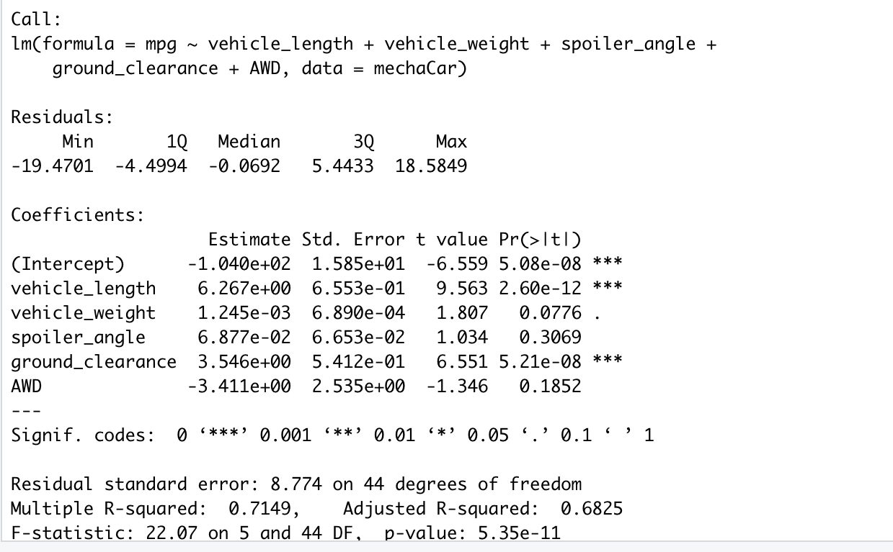
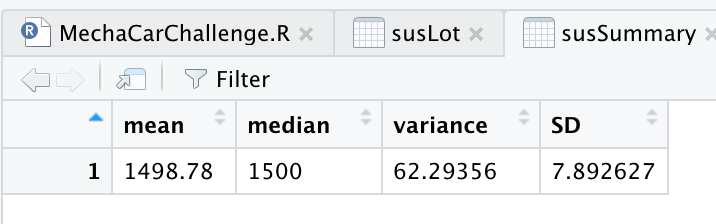
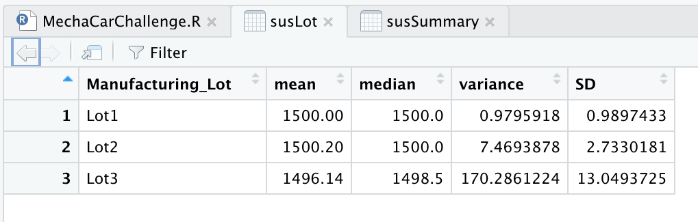
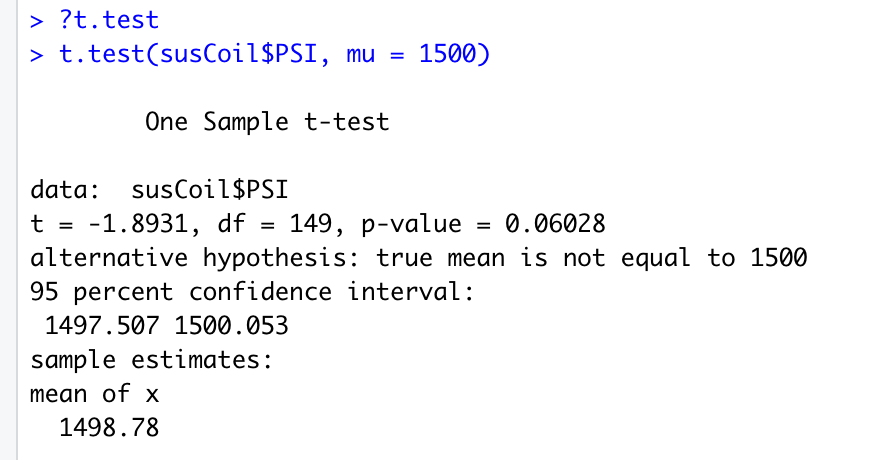
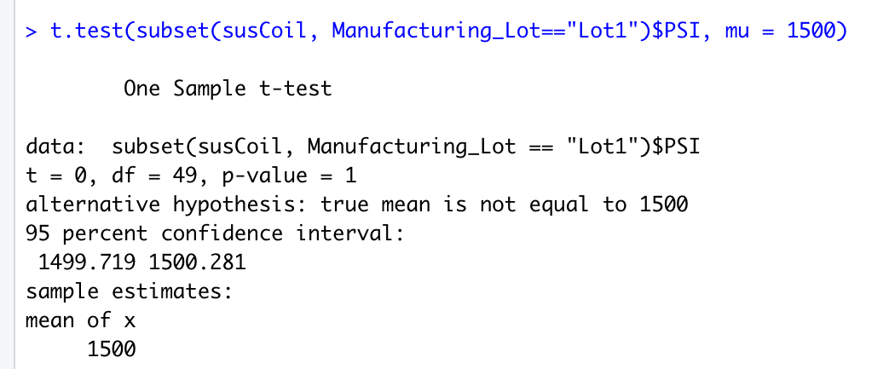
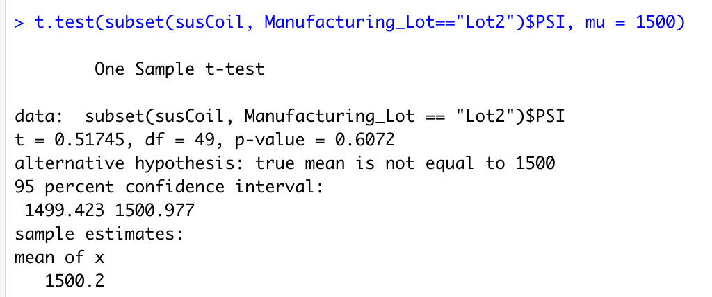
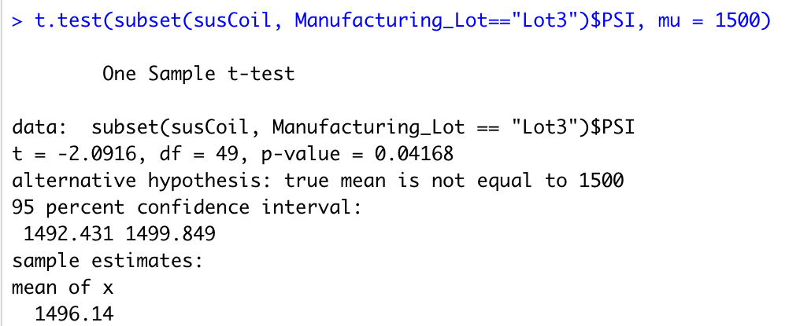

# MechaCar_Statistical_Analysis

## Table of Contents
[Overview](#Overview)

[Resources](#Resources)

[LinearRegression](#LinearRegression)

[SuspensionCoils](#suscoils)

[T-Test](#Ttest)

[StudyDesign](#StudyDesign)

## <u>Overview</u> 
In this project, we are helping AutosRU and their manufacturing team to analyze the production data so they can work through their production issues. To do this we need to:

* Perform multiple linear regression analysis to show variables in the dataset
* Show summary statistics on the PSI of the suspension coils from the manufacturing lots
* Run t-tests to see if the manufacturing lots are different from the mean population
* Compare the prototype vehicle performance against vehicles from other manufacturers.

______

## <u>Resources</u> 
Data Sources: MechaCar_mpg.csv, Suspention_Coil.csv

Software: RStudio, Visual Studio Code

____

## <u>Linear Regression to Predict MPG</u>

 

### <u>Vehicle MPG Statistics</u>:

### <u>Stat Summary</u>:
 
Question 1:

>Which variables/coefficients provided a non-random amount of variance to the mpg values in the dataset?

The vehicle length and the ground clearance are the most likely to provide a non-random amount of variance to the MPG, meaning they have the most impact on the MPG of the prototype.

Question 2:

> Is the slope of the linear model considered to be zero? Why or why not?

The Slope is not zero. The p-value is 5.35e-11, which is significantly lower than 0.05%. This would indicate that this would also reject our null hypothesis.

Question 3: 

> Does this linear model predict mpg of MechaCar prototypes effectively? Why or why not?

The linear model does predict the MGP efficiently. The multiple R-squared value is 0.7149, or 71%, which confirms can be used for accurate prediction.

_______
 

## <u>Summary Statistics on Suspension Coils</u>

 

### <u>Suspension Summary</u>:

### <u>Suspension Manufacturing Lot</u>:

### <u>Stat Summary</u>:
 

Question 1:
> The design specifications for the MechaCar suspension coils dictate that the variance of the suspension coils must not exceed 100 pounds per square inch. Does the current manufacturing data meet this design specification for all manufacturing lots in total and each lot individually? Why or why not?

The variance for the entire lot is 62.3, which is well within the 100 PSI requirement. When we break down lot 1, 2, 3, we run into an issue.
* Lot 1 has a 0.9 variance
* Lot 2 has a 7.4 variance
* Lot 3 has a 170.2 variance

Lot 1 and 2 still run well within the requirement but lot 3 greatly exceed the requirement, greatly affecting the average.

_____

 

## <u>T-Test on Suspension Coils</u>:

 

### <u>T-Test across all manufacturers</u>

### <u>Lot 1 T-Test</u>

### <u>Lot 2 T-Test</u>

### <u>Lot 3 T-Test</u>

### <u>T-Test Summary</u>:

 

> Determine if all manufacturing lots and each lot individually are statistically different from the population mean of 1,500 pounds per square inch.

All of the T-Test show there isnt a significant difference from the population mean of 1,500. All the P-values are statistically similar and not enough to reject the null hypothesis. These test show Lot 3's previous outlier should be further investigated. 

_______

## <u>Study Design: MechaCar vs Competition</u> 

The MechaCar has several aspects that needs to be tested vs the current competitors out there. A big issue is maintenance cost. Some of the most popular, common cars are ones that are relatively cheap to maintain, which keeps more of that car on the road for years to come. To achieve this we have to ask ourselves a few questions:

>What metric or metrics are you going to test?

We have to test the longevity of the most common replaceable parts on a car

>What is the null hypothesis or alternative hypothesis?

The prototypes car part prices, and how they compare to the competitors over time.

>What statistical test would you use to test the hypothesis? And why?

We could use the t-test method, and plot it out using our ggplot2 library. It can give us an average number over time to compare with, and the ability to plot it out using a graph would make it easier to read.

>What data is needed to run the statistical test?

We would have to take the data from several stress tests over X period of time, and compare it to the competitors during that same amount of duration, as well and the price of each stressed car part. 